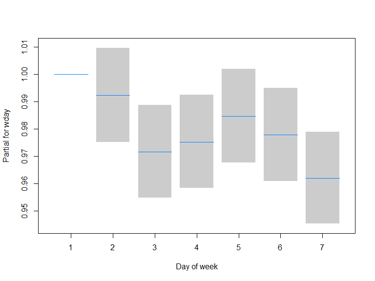

\tableofcontents[subsubsectionstyle=hide/hide/hide]

# Introduction

### What is a time series? Why they are important to us?

- ,,Observations made over time'' (i.e. they are ordered)
- As a sample vs. in the population (stochastic process)
- Many-many (and important) biomedical data are available as time series
- Traditional methods can be applied -- but the nature of time series must be taken into account
- Many special methods too

### Main aims today (why is it a tutorial?)

- Maximum number of areas with minimum detail on each
- Practical, real-life examples for all methods
- All calculation is made with R
    - Free and open source (<http://www.r-project.org/>)
    - Enthusiastic, extremely active community; incredible number of packages at CRAN
    - (There is an R package for any statistical task you can think of\dots{} and for many that you can't even think of)
    - It includes packages making complex operations one-liners, streamlining entire analysis workflows (like Frank Harrell's wonderful \texttt{rms} for regression)
    - A powerful IDE called RStudio (<http://www.rstudio.org/>) is freely available
    - Extremely good at visualization (this presentation will use \texttt{lattice}), report generation, reproducible research too (just like this presentation!)
- Whole source code of this presentation is available at <https://github.com/tamas-ferenci/BiomedicalApplicationsOfTimeSeriesAnalysis>

### Methods applied in the analysis of biomedical time series

- It is somewhat ill-defined what can be considered ,,time series analysis''
- I now try to be as broad as possible
- Therefore, a rough (and very subjective) categorization:
    - Analysis of data that are only meaningful when collected over time: typically biomedical signals such as ECG or EEG
    - Analysis of data that are meaningful cross-sectionally, but measurements are repeated to obtain information on the time dimension too: typical in longitudinal studies, analysis of growth curves
    - Analysis of epidemiologic data with time dimension: typically incidence of diseases
    
### Aims of time series analysis

As with any statistical model:

- Understanding phenomena (analysis, interpretation of the model, answering medical questions based on the results)
- Forecasting

### Time series in R

The `ts` is the basic time series object, it can be multivariate, but it can only handle evenly spaced time series (see `zoo` for unevenly spaced time series for example):


```r
ts( rnorm( 20 ), frequency = 4, start = c( 2010, 2 ) )
```

```
##            Qtr1       Qtr2       Qtr3       Qtr4
## 2010            -0.7959257 -0.1512653 -0.3575611
## 2011 -0.7956175 -0.1880978  0.2254061  0.8224560
## 2012  1.3941882 -0.8977673  1.0242012  1.1818423
## 2013 -2.1265545 -1.3074036 -0.9922208 -0.3795757
## 2014 -0.1981558  0.9191271  0.5872626 -0.8322504
## 2015  1.3388344
```

```r
ts( rnorm( 30 ), frequency = 12, start = c( 2010, 2 ) )
```

```
##              Jan         Feb         Mar         Apr         May
## 2010             -1.34905845 -1.08165926 -0.26791001 -0.33187780
## 2011 -0.98080258  1.06546991  1.72213959 -0.32019389 -0.09044677
## 2012 -0.60040047  1.55106769  0.63542068  0.28087855  1.63617577
##              Jun         Jul         Aug         Sep         Oct
## 2010 -0.17594537 -0.78469569 -1.62952706  1.65900243 -0.29385689
## 2011  1.37086585 -0.18889592 -1.00193031  1.84303233 -0.85811827
## 2012 -0.28285983  0.93290711                                    
##              Nov         Dec
## 2010  0.48908285 -0.07639366
## 2011 -0.89801476 -0.17180304
## 2012
```

### Using time series objects in R


```r
ldeaths
```

```
##       Jan  Feb  Mar  Apr  May  Jun  Jul  Aug  Sep  Oct  Nov  Dec
## 1974 3035 2552 2704 2554 2014 1655 1721 1524 1596 2074 2199 2512
## 1975 2933 2889 2938 2497 1870 1726 1607 1545 1396 1787 2076 2837
## 1976 2787 3891 3179 2011 1636 1580 1489 1300 1356 1653 2013 2823
## 1977 3102 2294 2385 2444 1748 1554 1498 1361 1346 1564 1640 2293
## 1978 2815 3137 2679 1969 1870 1633 1529 1366 1357 1570 1535 2491
## 1979 3084 2605 2573 2143 1693 1504 1461 1354 1333 1492 1781 1915
```

```r
plot( ldeaths )
```


# Spectral analysis (analysis in the frequency domain)

## Fourier analysis

### Fourier analysis

- Fundamental idea: every periodic function can be represented as a weighted sum of sinusoidals (sine waves)
- We may need infinite number of sinusoidals, but still countable many, the frequency of which are all multiples of a fundamental frequency
- If the function is non-periodic, it still works (quite universally), but we will need uncountably many terms
- Intuitive interpretation: how important is a certain frequency in making up the time series (what periodicites are present, and with what weight?)

### Why is is it useful?

It gives a picture of what frequencies ''create'' the signal:

```r
SimDataFourier <- data.frame( t = 1:1000 )
SimDataFourier <- transform( SimDataFourier, y = 0.5*sin( t*2 ) + sin( t/10*2 ) +
                               rnorm( length( t ), 0, 0.1 ) )
xyplot( y ~ t, data = SimDataFourier, type = "l", xlim = c( 0, 200 ) )
```


### Why is is it useful?

It gives a picture of what frequencies ''create'' the signal:

```r
xyplot( spec ~ freq, data = spectrum( SimDataFourier$y, plot = FALSE ), type = "l",
        scales = list( y = list( log = 10 ) ) )
```


### Why is is it useful?

(Sidenote) Custom plotting:

```r
locmaxpanel <- function( x, y, width, maxmeddiff = 1, rounddigit = 2, ... ) {
  if( width%%2==0 )
    width <- width+1
  panel.xyplot( x, y, ... )
  maxs <- zoo::rollapply( y, width, function(x) (which.max(x)==(width+1)/2)&
                            (max(x)-median(x)>maxmeddiff),
                          align = "center", fill = NA )
  panel.abline( v = x[ maxs ], col = "gray" )
  panel.points( x[ maxs ], y[ maxs ] )
  panel.text( x[ maxs ], y[ maxs ], round( x[ maxs ], rounddigit ), pos = 4 )
}
```

### Why is is it useful?


```r
xyplot( spec ~ freq, data = spectrum( SimDataFourier$y, plot = FALSE ), type = "l",
        scales = list( y = list( log = 10 ) ), panel = locmaxpanel, width = 21, maxmeddiff = 2 )
```


### Case study: ECG analysis


```r
## require( tuneR ) ## require( pastecs ) ## devtools::install_github( "mkfs/r-physionet-ptb" )
## https://www.physionet.org/physiobank/database/ptbdb/
## system2( system.file( "exec", "download_ptb.sh", package = "r.physionet.ptb" ) )
## system2( system.file( "exec", "ptb_patient_to_json.rb", package = "r.physionet.ptb" ),
## args="patient001" )
library( r.physionet.ptb )
ptb <- r.physionet.ptb::ptb.from.file( "patient001.json" )
ptbecg <- r.physionet.ptb::ptb.extract.lead( ptb, "i" )$`1-10010`
xyplot( ptbecg~seq_along( ptbecg ), type = "l", xlim = c( 0, 5000 ), xlab = "Time", ylab = "" )
```


### Case study: ECG analysis


```r
xyplot( spec ~ freq, data = spectrum( ptbecg, plot = FALSE, span = rep( 201, 3 ) ), type = "l",
        scales = list( y = list( log = 10 ) ), panel = locmaxpanel, width = 21,
        maxmeddiff = 2e-4 )
```


## Wavelet analysis

### Problems of spectral analysis (and possible solutions)

- Assumes that the spectrum is constant over time: no change in this sense
- One possible way to relax this: windowed analyis (short-term Fourier transform, STFT)
- Trade-off between time-resolution and frequency resolution
- An alternative modern method: wavelet analysis
- Roughly speaking: we perform (a) a local search (b) everywhere (c) with many different frequencies

### Problems of spectral analysis (and possible solutions)


```r
SimDataWavelet <- data.frame( t = 1:2000 )
SimDataWavelet <- transform( SimDataWavelet,
                             y = ifelse( t<=1000, sin( t*2 ), sin( t/10*2 ) ) +
                               rnorm( length( t ), 0, 0.1 ) )
xyplot( y ~ t, data = SimDataWavelet, type = "l" )
```


### Problems of spectral analysis (and possible solutions)


```r
xyplot( spec ~ freq, data = spectrum( SimDataWavelet$y, plot = FALSE ), type = "l",
        scales = list( y = list( log = 10 ) ) )
```


### Result of wavelet transform


```r
WaveletComp::wt.image( WaveletComp::analyze.wavelet( SimDataWavelet, "y",
                                                     verbose = FALSE, make.pval = FALSE ) )
```


### Problems of spectral analysis (and possible solutions)


```r
SimDataWavelet <- data.frame( t = 1:2000 )
SimDataWavelet <- transform( SimDataWavelet,
                             y = WaveletComp::periodic.series( start.period = 20,
                                                               end.period = 200,
                                                  length = length( t ) ) +
                               0.1*rnorm( length( t ) ) )
xyplot( y ~ t, data = SimDataWavelet, type = "l" )
```


### Problems of spectral analysis (and possible solutions)


```r
xyplot( spec ~ freq, data = spectrum( SimDataWavelet$y, plot = FALSE ), type = "l",
        scales = list( y = list( log = 10 ) ) )
```


### Result of wavelet transform


```r
WaveletComp::wt.image( WaveletComp::analyze.wavelet( SimDataWavelet, "y",
                                                     verbose = FALSE, make.pval = FALSE ) )
```


### Case study for wavelet analysis: pertussis incidence

(Sidenote) A bit of data scraping:

```r
tmpfile <- tempfile( fileext = ".xlsx" )
download.file( url = paste0( "https://www.gov.uk/government/uploads/system/uploads/",
                             "attachment_data/file/339410/NoidsHistoricAnnualTotals.xlsx" ),
               destfile = tmpfile, mode = "wb" )
res1 <- XLConnect::loadWorkbook( tmpfile )
XLConnect::setMissingValue( res1, value = c( "*" ) )
res1 <- do.call( plyr::rbind.fill, lapply( XLConnect::getSheets( res1 ), function( s ) {
  temp <- XLConnect::readWorksheet( res1, sheet = s, startRow = 4 )
  temp <- temp[ , grep( "Disease", colnames( temp ) ):ncol( temp ) ]
  temp <- temp[ 1:( if( sum( is.na( temp$Disease ) )==0 ) nrow( temp ) else
    which( is.na( temp$Disease ) )[ 1 ]-1 ), ]
  for( i in 2:ncol( temp ) )
    temp[ , i ] <- as.numeric( gsub( "[[:space:].,‡†]", "", temp[ , i ] ) )
  temp2 <- as.data.frame( t( temp[ , - 1 ] ) )
  colnames( temp2 ) <- temp[ , 1 ]
  temp2$Year <- as.numeric( substring( rownames( temp2 ), 2, 5 ) )
  temp2
} ) )
unlink( tmpfile )
```

### Case study for wavelet analysis: pertussis incidence

(Sidenote) A bit of data scraping:

```r
tmpfile <- tempfile( fileext = ".xlsx" )
download.file( url = paste0( "https://www.gov.uk/government/uploads/system/uploads/",
                             "attachment_data/file/664864/",
                             "Annual_totals_from_1982_to_2016.xlsx" ),
               destfile = tmpfile, mode = "wb" )
res2 <- XLConnect::loadWorkbook( tmpfile )
XLConnect::setMissingValue( res2, value = c( "--" ) )
res2 <- do.call( plyr::rbind.fill, lapply( XLConnect::getSheets( res2 )[ -1 ], function( s ) {
  temp <- XLConnect::readWorksheet( res2, sheet = s, startRow = 5 )
  temp <- temp[ 1:( nrow( temp )-1 ), ]
  temp2 <- as.data.frame( t( temp[ , - 1 ] ) )
  colnames( temp2 ) <- temp[ , 1 ]
  temp2$Year <- as.numeric( substring( rownames( temp2 ), 2, 5 ) )
  temp2
} ) )
unlink( tmpfile )
```

### Case study for wavelet analysis: pertussis incidence

(Sidenote) A bit of data scraping:

```r
tmpfile <- tempfile( fileext = ".xls" )
download.file( url = paste0( "https://www.ons.gov.uk/file?uri=/",
                             "peoplepopulationandcommunity/populationandmigration/",
                             "populationestimates/adhocs/",
                             "004358englandandwalespopulationestimates1838to2014/",
                             "englandandwalespopulationestimates18382014tcm77409914.xls" ),
               destfile = tmpfile, mode = "wb" )
res3 <- XLConnect::readWorksheetFromFile( tmpfile, sheet = "EW Total Pop 1838-2014", startRow = 2,
                               endRow = 179 )
unlink( tmpfile )
names( res3 )[ 1 ] <- "Year"
res3$Persons <- ifelse( res3$Persons < 100000, res3$Persons*1000, res3$Persons )
res3 <- res3[ , c( "Year", "Persons" ) ]
res4 <- read.csv( paste0( "https://www.ons.gov.uk/generator?format=csv&uri=/",
                          "peoplepopulationandcommunity/populationandmigration/",
                          "populationestimates/timeseries/ewpop/pop" ), skip = 7 )
names( res4 ) <- c( "Year", "Persons" )
res4 <- res4[ res4$Year>=2015, ]
UKEpid <- merge( plyr::rbind.fill( res1, res2 ), rbind( res3, res4 ) )
UKPertussis <- UKEpid[ , c( "Year", "Whooping cough", "Persons" ) ]
UKPertussis$Inc <- UKPertussis$`Whooping cough`/UKPertussis$Persons*100000
UKPertussis <- UKPertussis[ !is.na( UKPertussis$`Whooping cough` ), ]
```

### Case study for wavelet analysis: pertussis incidence


```r
xyplot( Inc ~ Year, data = UKPertussis, type = "l", ylab = "Incidence [/100 000/year]" )
```


### Case study for wavelet analysis: pertussis incidence


```r
WaveletComp::wt.image( WaveletComp::analyze.wavelet( UKPertussis, "Inc",
                                                     verbose = FALSE, make.pval = FALSE ) )
```


# Time series regression

## Regression models for time series

### Regression models

- Regression is perhaps \emph{the} most powerful tool for the analysis of time series in the time domain
- With appropriate measures taken to account for the nature of the data
- This of course gives rise to all usual issues of regression models (model specification such as the question of non-linearities, model diagnostics etc.)
- Mostly models with exogeneous regressors are used, stochastic models are employed much less often

### Applications in epidemiology

- Count data are typical, giving rise to Generalized Linear Models
- Further complications within GLMs, such as overdispersion
- Need to take changing age- and sex composition into account
- Traditionally: standardization, but in the modern approach they're just confounders!
- Models can include many resolutions (scales) in time

### Case study: CV mortality in elderly in Los Angeles from 1987 to 2000


```r
data( "CVDdaily", package = "season" )
rownames( CVDdaily ) <- NULL
xyplot( cvd ~ date, data = CVDdaily, type = "l", xlab = "Time", ylab = "Number of deaths" )
```


### Case study: CV mortality in elderly in Los Angeles from 1987 to 2000


```r
CVDdaily$year <- lubridate::year( CVDdaily$date )
CVDdaily$wday <- as.factor( lubridate::wday( CVDdaily$date, week_start = 1 ) )
CVDdaily$yday <- lubridate::yday( CVDdaily$date )/yearDays( CVDdaily$date )
head( CVDdaily[ , c( "date", "year", "wday", "yday", "cvd" ) ] )
```

<div class="kable-table">

date          year  wday         yday   cvd
-----------  -----  -----  ----------  ----
1987-01-01    1987  4       0.0027397    55
1987-01-02    1987  5       0.0054795    73
1987-01-03    1987  6       0.0082192    64
1987-01-04    1987  7       0.0109589    57
1987-01-05    1987  1       0.0136986    56
1987-01-06    1987  2       0.0164384    65

</div>

### Case study: CV mortality in elderly in Los Angeles from 1987 to 2000


```r
library( mgcv )
fit <- gam( cvd ~ s( as.numeric( date ) ) + wday + s( yday, bs = "cc" ), data = CVDdaily,
            family = nb( link = log ) )
summary( fit )
```

```
## 
## Family: Negative Binomial(177.091) 
## Link function: log 
## 
## Formula:
## cvd ~ s(as.numeric(date)) + wday + s(yday, bs = "cc")
## 
## Parametric coefficients:
##              Estimate Std. Error z value Pr(>|z|)    
## (Intercept)  3.820888   0.006137 622.550  < 2e-16 ***
## wday2       -0.007799   0.008687  -0.898 0.369335    
## wday3       -0.028719   0.008724  -3.292 0.000995 ***
## wday4       -0.025035   0.008714  -2.873 0.004065 ** 
## wday5       -0.015468   0.008697  -1.778 0.075323 .  
## wday6       -0.022458   0.008709  -2.579 0.009920 ** 
## wday7       -0.038679   0.008738  -4.427 9.57e-06 ***
## ---
## Signif. codes:  0 '***' 0.001 '**' 0.01 '*' 0.05 '.' 0.1 ' ' 1
## 
## Approximate significance of smooth terms:
##                       edf Ref.df Chi.sq p-value    
## s(as.numeric(date)) 7.696  8.568  254.4  <2e-16 ***
## s(yday)             7.771  8.000 2732.5  <2e-16 ***
## ---
## Signif. codes:  0 '***' 0.001 '**' 0.01 '*' 0.05 '.' 0.1 ' ' 1
## 
## R-sq.(adj) =  0.377   Deviance explained = 37.6%
## -REML =  17546  Scale est. = 1         n = 5114
```

### Case study: CV mortality in elderly in Los Angeles from 1987 to 2000


```r
plot( fit, select = 1, scale = 0, rug = FALSE, trans = exp, shade = TRUE,
      col = trellis.par.get()$superpose.line$col[1], xaxt = "n", xlab = "Year", ylab = "IRR" )
axis( 1, at = seq( CVDdaily$date[1], tail( CVDdaily$date, 1 )+1, by = "year" ),
      labels = year( CVDdaily$date[1] ):year( tail( CVDdaily$date, 1 )+1 ) )
```


### Case study: CV mortality in elderly in Los Angeles from 1987 to 2000


```r
plot( fit, select = 2, scale = 0, rug = FALSE, trans = exp, shade = TRUE,
      col = trellis.par.get()$superpose.line$col[1], xaxt = "n", xlab = "Day of year",
      ylab = "IRR" )
axis( 1, at = seq( 0, 1, 1/12 ), labels = seq( 0, 1, 1/12 )*30*12 )
```


### Case study: CV mortality in elderly in Los Angeles from 1987 to 2000


```r
source( "https://pastebin.com/raw/hBmStX4Y" )
termplot2( fit, terms = "wday", se = TRUE, yscale = "exponential",
           col.term = trellis.par.get()$superpose.line$col[1],
           col.se = "gray80", se.type = "polygon", xlab = "Day of week" )
```



## Filtering and smoothing

### Filtering

- Filter: we create another time series from the investigated one
- Consider the well-known moving average filter:
\[
  y'\left(t\right)=\frac{y_t+y_{t-1}+y_{t-2}+\ldots+y_{t-\left(p-1\right)}}{p}
\]
- Traditionally used to ''filter noise'' or to separate components of the time series (decompose the time series)
- This can be achieved using deterministic time series regression (''model-based decomposition''), see the previous example
- But filters like the above moving average allows us to decompose the time series without assuming a parametric model

### Filtering

Its operation can actually be best understood in frequency domain: it filters out high-frequency components (and retains low-frequency):


```r
do.call( gridExtra::grid.arrange, lapply( c( 2, 6, 12, 24 ), function( o ) {
  xyplot( y ~ t, groups = grp, data = rbind( data.frame( grp = "data", SimDataFourier ),
                                             data.frame( grp = "smooth", t = SimDataFourier$t,
                                                         y = forecast::ma( SimDataFourier$y,
                                                                           o ) ) ),
          type = "l", xlim = c( 0, 200 ), main = paste0( "Order: ", o ) )
} ) )
```


### Case study: lung deaths in the UK, 1974-1979 -- moving average


```r
plot( decompose( ldeaths ) )
```


### Case study: lung deaths in the UK, 1974-1979 -- LOESS


```r
plot( stl( ldeaths, s.window = "periodic" ) )
```


### Case study: lung deaths in the UK, 1974-1979 -- seasonal adjustment


```r
plot( forecast::seasadj( stl( ldeaths, s.window = "periodic" ) ) )
```


# Analysis of longitudinal data

## General considerations

### Repeated measures data (longitudinal studies)

- Same variables measured again and again over time, for the same subjects
- Typical questions: effect of an intervention, or natural history (growth curve)
- Usual tool: regression models, usual problem: intra-individual correlation (clustered data)
- Mostly obsolote solutions: RM-ANOVA (has many assumptions that are hard to test, and are usually not met in practice), pairwise tests (multiple comparisons problem, no interpolation possible, etc.), summary statistics (data are reduced to a few parameters in the first step, dramatic loss of information among others)

### Usual solutions

- Cluster-robust standard errors or GLS (works only for continuous responses)
- Mixed effects models (can handle hiearchical models, parameters can be different for each subject)
- Generalized Estimating Equations (marginal model)

## Generalized Least Squares

### Basic idea

- OLS assumes no autocorrelation (and homoscedasticity)
- This can be relaxed if the correlation structure is known 
- Can be estimated from the data
- The OLS parameter estimates are unbiased and consistent even with autocorrelation, but the estimates of the error covariance matrix (thus the estimates of the standard errors) are biased
- GLS changes the standard errors to account for the correlation

### Case study: Treatment of Lead Exposed Children Trial


```r
TLCData <- read.table( "https://content.sph.harvard.edu/fitzmaur/ala2e/tlc-data.txt",
                       col.names = c( "ID", "Trt", paste0( "Wk", c( 0, 1, 4, 6 ) ) ) )
TLCData <- reshape( TLCData, varying = paste0( "Wk", c( 0, 1, 4, 6 ) ), v.names = "LeadLevel",
                    timevar = "Week", times = c( 0, 1, 4, 6 ), idvar = "ID", direction = "long" )
TLCData$Trt <- relevel( TLCData$Trt, ref = "P" )
TLCData$Week.f <- as.factor( TLCData$Week )
xyplot( LeadLevel ~ Week | Trt, groups = ID, data = TLCData, type = "b" )
```


### Case study: Treatment of Lead Exposed Children Trial


```r
TLCData <- data.table( TLCData )
TLCData$Time <- as.numeric( TLCData$Week.f )
dd <- datadist( TLCData )
options( datadist = "dd" )
xYplot( Cbind( mean, lwr, upr ) ~ Week, groups = Trt, type = "b",
        data = TLCData[ , .( mean = mean( LeadLevel ),
                             lwr = t.test( LeadLevel )$conf.int[1],
                             upr = t.test( LeadLevel )$conf.int[2] ) , .( Trt, Week ) ],
        ylim = c( 10, 30 ), ylab = "Mean lead level" )
```


### Case study: Treatment of Lead Exposed Children Trial


```r
ols( LeadLevel ~ Week.f*Trt, data = TLCData )
```

```
## Linear Regression Model
##  
##  ols(formula = LeadLevel ~ Week.f * Trt, data = TLCData)
##  
##                 Model Likelihood     Discrimination    
##                    Ratio Test           Indexes        
##  Obs     400    LR chi2    159.22    R2       0.328    
##  sigma6.6257    d.f.            7    R2 adj   0.316    
##  d.f.    392    Pr(> chi2) 0.0000    g        4.920    
##  
##  Residuals
##  
##      Min      1Q  Median      3Q     Max 
##  -16.662  -4.620  -0.993   3.673  43.138 
##  
##  
##                   Coef     S.E.   t     Pr(>|t|)
##  Intercept         26.2720 0.9370 28.04 <0.0001 
##  Week.f=1          -1.6120 1.3251 -1.22 0.2245  
##  Week.f=4          -2.2020 1.3251 -1.66 0.0974  
##  Week.f=6          -2.6260 1.3251 -1.98 0.0482  
##  Trt=A              0.2680 1.3251  0.20 0.8398  
##  Week.f=1 * Trt=A -11.4060 1.8740 -6.09 <0.0001 
##  Week.f=4 * Trt=A  -8.8240 1.8740 -4.71 <0.0001 
##  Week.f=6 * Trt=A  -3.1520 1.8740 -1.68 0.0934  
## 
```

### Case study: Treatment of Lead Exposed Children Trial


```r
fit <- Gls( LeadLevel ~ Week.f*Trt, data = TLCData, corr = nlme::corSymm( form = ~ Time | ID ),
     weights = nlme::varIdent( form = ~ 1 | Week.f ) )
fit
```

```
## Generalized Least Squares Fit by REML
##  
##  Gls(model = LeadLevel ~ Week.f * Trt, data = TLCData, correlation = nlme::corSymm(form = ~Time | 
##      ID), weights = nlme::varIdent(form = ~1 | Week.f))
##  
##                                                      
##  Obs 400        Log-restricted-likelihood-1208.04    
##  Clusters100    Model d.f.  7                        
##  g 4.920        sigma  5.0225                        
##                 d.f.      392                        
##  
##                   Coef     S.E.   t      Pr(>|t|)
##  Intercept         26.2720 0.7103  36.99 <0.0001 
##  Week.f=1          -1.6120 0.7919  -2.04 0.0425  
##  Week.f=4          -2.2020 0.8149  -2.70 0.0072  
##  Week.f=6          -2.6260 0.8885  -2.96 0.0033  
##  Trt=A              0.2680 1.0045   0.27 0.7898  
##  Week.f=1 * Trt=A -11.4060 1.1199 -10.18 <0.0001 
##  Week.f=4 * Trt=A  -8.8240 1.1525  -7.66 <0.0001 
##  Week.f=6 * Trt=A  -3.1520 1.2566  -2.51 0.0125  
##  
##  Correlation Structure: General
##   Formula: ~Time | ID 
##   Parameter estimate(s):
##   Correlation: 
##    1     2     3    
##  2 0.571            
##  3 0.570 0.775      
##  4 0.577 0.582 0.581
##  Variance function:
##   Structure: Different standard deviations per stratum
##   Formula: ~1 | Week.f 
##   Parameter estimates:
##         0        1        4        6 
##  1.000000 1.325884 1.370443 1.524804 
## 
```

### Case study: Treatment of Lead Exposed Children Trial


```r
temp <- Predict( fit, Trt, Week.f )
temp$Week.f <- as.numeric( levels( temp$Week.f ) )[ temp$Week.f ]
xYplot( Cbind( yhat, lower, upper ) ~ Week.f, groups = Trt, data = temp, type = "b",
        ylim = c( 10, 30 ) )
```


## Mixed effects models

### Basic idea

- Two extremes: fitting a single model to all subjects vs. fitting an own model to each
- The latter is not efficient (a few observations to estimate the parameters, and this doesn't improve with sample size), and we are often not interested in each subject individually
- A mixed model is a compromise: assumes not a single parameter (for all sujects), nor many (one for each), but rather it assumes that the parameter is a random draw from a population (i.e. a population distribution is assumed for the parameter), presumed to be normally distributed, so only two parameters are estimated, a mean and a variance
- We infer on the population (in which we are really interested), and also it is more efficient, as we have a fixed number of parameters (2)
- Yet we can calculate individual curves (parameters calculated like the residuals in a regression)
- Induces a correlation structure

### Case study: human skull growth


```r
data( "Orthodont", package = "nlme" )
OrthoFem <- Orthodont[ Orthodont$Sex=="Female", ]
plot( OrthoFem )
```


### Case study: human skull growth


```r
fit1 <- nlme::lmList( distance ~ I( age - 11 ), data = OrthoFem )
plot( nlme::intervals( fit1 ) )
```


### Case study: human skull growth


```r
fit2 <- nlme::lme( distance ~ age, data = OrthoFem, random = ~1|Subject )
xyplot( distance + fitted( fit1 ) + fitted( fit2, level = 1 ) +
          fitted( fit2, level = 0 ) ~ age | Subject, data = OrthoFem,
        type = c( "p", "l", "l", "l" ), distribute.type = TRUE, ylab = "Distance", grid = TRUE,
        auto.key = list( text = c( "Measured", "Fitted (individual models)",
                                   "Fitted (mixed effects)", "Fitted (fixed effects only)" ),
                         columns = 4, points = FALSE, lines = TRUE ) )
```


# Concluding remarks

### A few words on what we did not cover

- (Non-parametric) filtering and smoothing (LOESS, weighted moving average, Holt-Winters, exponential smoothing etc.)
- Tools of stochastic modelling (stationarity, autocorrelation function, ARIMA models etc.)
- Multivariate time series (coherence, cross-correlation, VAR models etc.)
- Questions of forecasting, quantifying forecast accuracy, comparing forecasts, validation
- Long-range memory
- State-space models
- Regime switching models
- etc. etc. etc.

### Role of time series analysis

- The biomedical application of time series data is getting more and more intensive
- They have role from basic science through clinical investigations to policymaking
- Understanding and -- sound! -- application of time series methods is of huge importance therefore
- This is not a problem of a selected few specialists: everyone working on biomedical field benefits from having basic knowledge about time series analysis

### Some useful references {.allowframebreaks}
